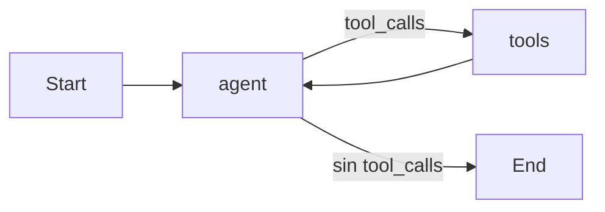
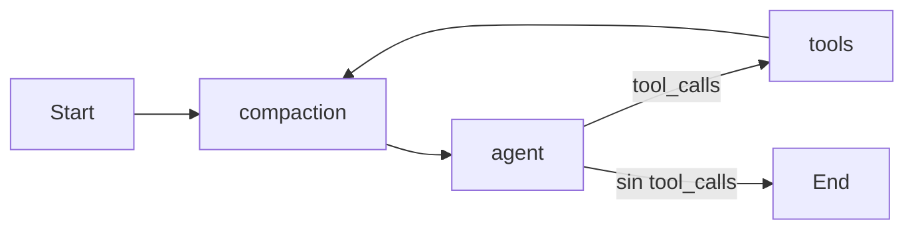

# Plan De Compaction Del Grafo

## Objetivo
Agregar un `compaction` node transparente al flujo del agente para controlar el crecimiento del historial sin tocar la logica central de tools, HITL ni persistencia de sesion. La compactacion tendra dos etapas:
- `microcompact` siempre, para limpiar resultados viejos de tools a costo casi cero.
- `llm compaction` solo cuando el historial estimado supere el 80% de la ventana configurada.

## Diseno Acordado
- Mantener el diseno agnostico al proveedor.
- Usar modelos separados por responsabilidad: agente principal y compaction.
- Si no hay configuracion especifica para compaction, usar fallback al modelo principal.
- Medir el umbral con estimacion simple, no con tokenizacion especifica por modelo.
- No tocar la logica existente de `toolExecutorNode`, `interrupt()` ni `resumeAgent()`.

## Flujo Actual vs Nuevo

## Archivos Afectados
- [packages/agent/src/graph.ts](packages/agent/src/graph.ts)
- [packages/agent/src/model.ts](packages/agent/src/model.ts)
- [packages/agent/src/nodes/compaction-node.ts](packages/agent/src/nodes/compaction-node.ts)

## Cambios Tecnicos
### 1. Estado del grafo
Agregar al `GraphState`:
- `compactionCount`
- `compactionFailureCount`

### 2. Nodo de compaction
Crear [packages/agent/src/nodes/compaction-node.ts](packages/agent/src/nodes/compaction-node.ts) para:
- aplicar `microcompact` siempre
- estimar tamano de historial por longitud de texto
- resumir con LLM solo al superar el 80%
- sanitizar salida del resumen
- preservar cola reciente
- activar circuit breaker tras 3 fallos consecutivos

### 3. Modelos por responsabilidad
Agregar `createCompactionModel()` en [packages/agent/src/model.ts](packages/agent/src/model.ts) con fallback al modelo principal.

### 4. Topologia nueva
Cambiar:
- `__start__ -> agent` por `__start__ -> compaction`
- `tools -> agent` por `tools -> compaction`
- agregar `compaction -> agent`

## Validacion
- conversacion normal sin tools
- conversacion con varias tools seguidas
- tool con confirmacion humana
- reanudacion con `resumeAgent()`
- ejecucion por cron de tareas programadas
- historial largo para disparar microcompact y luego llm compaction
