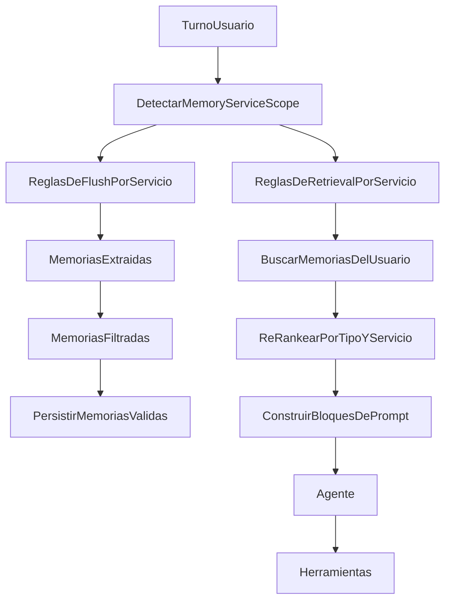

# Plan de Implementación de Memoria Selectiva

## Objetivo

Traducir la política definida en [docs/plans/memory-by-service-guidelines.md](docs/plans/memory-by-service-guidelines.md) a reglas ejecutables, de forma gradual, para que la memoria larga:

- guarde menos ruido desde origen
- recupere recuerdos relevantes según el servicio actual
- distinga entre recordar, sugerir y automatizar
- reduzca mezcla de contexto entre agenda, contactos, bash, archivos, GitHub y tareas programadas

## Estrategia elegida

Se implementará por fases:

1. selectividad heurística y gobernanza sin cambiar esquema
2. validación del comportamiento real por servicio
3. evolución estructurada opcional si la heurística se queda corta

## Cobertura por servicio

El cambio será extensivo a todos los servicios contemplados en la guía:

- `calendar`
- `contacts`
- `scheduled_tasks`
- `bash`
- `files`
- `github`
- `general`

`general` cubre turnos mixtos o ambiguos donde no exista un servicio dominante claro.

## Prioridad por fases y servicio

### Fase 1: Servicios prioritarios

Servicios con más valor potencial y también más riesgo si la memoria actúa de forma incorrecta:

- `calendar`
- `contacts`
- `scheduled_tasks`

Qué cambia primero aquí:

- detección explícita del servicio actual
- filtros de guardado por servicio en `memory_flush`
- retrieval selectivo por servicio
- separación entre recuerdos útiles y recuerdos solo sugeribles

### Fase 2: Servicios conservadores

Servicios donde la memoria debe ser más limitada y defensiva:

- `bash`
- `files`
- `github`

Qué cambia aquí:

- recordar preferencias de interacción
- evitar guardar acciones puntuales, rutas temporales o decisiones riesgosas
- impedir que la memoria justifique automatizaciones peligrosas

### Fase 3: Cobertura transversal

Servicios y turnos mixtos:

- `general`

Qué cambia aquí:

- reglas de fallback cuando el turno mezcla varias intenciones
- degradación segura hacia memoria no vinculante
- menor agresividad en inyección cuando no haya claridad suficiente

## Base actual

La implementación actual ya tiene los puntos correctos para intervenir:

- [packages/agent/src/memory-flush.ts](packages/agent/src/memory-flush.ts)
- [packages/agent/src/memory-retrieval.ts](packages/agent/src/memory-retrieval.ts)
- [packages/agent/src/graph.ts](packages/agent/src/graph.ts)
- [apps/web/src/lib/session-memory.ts](apps/web/src/lib/session-memory.ts)
- [apps/web/src/lib/message-preprocessing.ts](apps/web/src/lib/message-preprocessing.ts)
- [apps/web/src/lib/agent-runtime.ts](apps/web/src/lib/agent-runtime.ts)
- [packages/types/src/index.ts](packages/types/src/index.ts)
- [packages/db/src/queries/memories.ts](packages/db/src/queries/memories.ts)
- [packages/db/supabase/migrations/00004_long_term_memories.sql](packages/db/supabase/migrations/00004_long_term_memories.sql)

## Fase 1: Derivar servicio actual del turno

Crear una capa explícita de clasificación de contexto actual, reutilizando señales ya existentes del pipeline.

Archivos objetivo:

- [apps/web/src/lib/message-preprocessing.ts](apps/web/src/lib/message-preprocessing.ts)
- [apps/web/src/lib/agent-runtime.ts](apps/web/src/lib/agent-runtime.ts)
- [packages/agent/src/graph.ts](packages/agent/src/graph.ts)

Cambios:

- definir un tipo liviano `MemoryServiceScope` con valores `calendar`, `contacts`, `scheduled_tasks`, `bash`, `files`, `github`, `general`
- derivar ese scope a partir de:
  - prioridad del preprocesado que modificó el turno
  - regex e intención ya existentes
  - herramienta o subflujo dominante reciente cuando aplique
  - canal actual como señal secundaria
- pasar ese scope a retrieval y flush como contexto explícito

Resultado esperado:

- el sistema deja de tratar todos los turnos como memoria global
- retrieval y flush ya saben en qué servicio están operando

## Fase 2: Filtrar mejor qué se guarda en `memory_flush`

Aplicar la guía por servicio en el punto donde hoy se extraen recuerdos durables.

Archivos objetivo:

- [packages/agent/src/memory-flush.ts](packages/agent/src/memory-flush.ts)
- [docs/plans/memory-by-service-guidelines.md](docs/plans/memory-by-service-guidelines.md)

Cambios:

- reforzar el prompt extractor con `MemoryServiceScope` y reglas del servicio actual
- añadir filtro post-LLM para descartar recuerdos que violen política
- introducir una noción operativa de `memoryAction` en runtime:
  - `remember`
  - `suggest_only`
  - `never_automate`
- limitar `episodic` a casos realmente útiles

Ejemplos por servicio:

- `calendar`: no persistir asistentes aislados como default
- `contacts`: no persistir correos ambiguos como verdad durable
- `scheduled_tasks`: no convertir tareas viejas en plantilla automática
- `bash`: no persistir comandos puntuales
- `files`: no persistir rutas temporales ni contenidos concretos
- `github`: no persistir ramas temporales o repos ambiguos como supuestos

## Fase 3: Hacer retrieval selectivo por servicio y prioridad

Cambiar la recuperación para que no inyecte memorias cruzadas sin contexto.

Archivos objetivo:

- [packages/agent/src/memory-retrieval.ts](packages/agent/src/memory-retrieval.ts)
- [packages/agent/src/graph.ts](packages/agent/src/graph.ts)

Cambios:

- pasar `MemoryServiceScope` a `augmentSystemPromptWithMemories`
- re-rankear o filtrar resultados recuperados usando reglas en código:
  - priorizar `semantic` del mismo servicio
  - usar `procedural` con más cautela
  - permitir `episodic` solo cuando el servicio lo justifique
  - penalizar recuerdos que deban usarse solo como sugerencia
- construir bloques separados en prompt:
  - preferencias durables
  - sugerencias históricas no vinculantes
  - restricciones operativas

Resultado esperado:

- `calendar` no hereda ruido de `bash` o `files`
- `contacts` no se contamina con recuerdos de `github`
- los servicios conservadores reciben menos memoria y más controlada

## Fase 4: Gobernar uso de memoria dentro del prompt

Hacer explícito qué puede usarse para sugerir y qué no puede disparar automatización.

Archivos objetivo:

- [packages/agent/src/memory-retrieval.ts](packages/agent/src/memory-retrieval.ts)
- [apps/web/src/lib/agent-runtime.ts](apps/web/src/lib/agent-runtime.ts)

Cambios:

- inyectar memoria con etiquetas de comportamiento
- instruir al agente a tratar ciertos recuerdos como contexto no vinculante
- reglas clave:
  - la memoria puede sugerir participantes probables, nunca elegirlos sola
  - la memoria puede sugerir duración habitual, no imponerla si hay ambigüedad
  - la memoria nunca sustituye una fuente viva como `contacts_lookup`
  - la memoria nunca justifica acciones riesgosas en `bash`, `files` o `github`

## Fase 5: Observabilidad y validación

Medir si la memoria selectiva realmente mejora comportamiento.

Archivos objetivo:

- [packages/agent/src/memory-flush.ts](packages/agent/src/memory-flush.ts)
- [packages/agent/src/memory-retrieval.ts](packages/agent/src/memory-retrieval.ts)
- [docs/plans/memory-by-service-guidelines.md](docs/plans/memory-by-service-guidelines.md)

Cambios:

- añadir logs o trazas mínimas para saber:
  - scope detectado
  - memorias candidatas descartadas
  - memorias inyectadas por tipo
  - memorias degradadas a `suggest_only`
- definir escenarios manuales por servicio:
  - `calendar`: recordar formato y duración, sin autoelegir asistentes
  - `contacts`: sugerir contacto previo, sin asumir correo ambiguo
  - `scheduled_tasks`: recordar estilo o canal, no clonar tareas viejas
  - `bash`, `files`, `github`: recordar preferencias de respuesta, no acciones riesgosas

## Fase 6: Evolución estructurada opcional

Si la heurística funciona pero se queda corta, preparar un paso posterior con modelo de datos explícito.

Archivos objetivo:

- [packages/db/supabase/migrations/00004_long_term_memories.sql](packages/db/supabase/migrations/00004_long_term_memories.sql)
- [packages/db/src/queries/memories.ts](packages/db/src/queries/memories.ts)
- [packages/types/src/index.ts](packages/types/src/index.ts)

Cambios potenciales:

- agregar `service_scope` o `memory_tags`
- persistir `memory_action`
- permitir filtros SQL o RPC por servicio además de similitud vectorial

## Orden recomendado de implementación

1. Derivar `MemoryServiceScope` y propagarlo a retrieval y flush.
2. Aplicar filtros de guardado por servicio en `memory-flush`.
3. Aplicar filtros y prioridades de recuperación por servicio.
4. Etiquetar en prompt qué es sugerencia y qué no puede automatizar.
5. Añadir observabilidad y ejecutar validaciones manuales.
6. Evaluar si hace falta cambio de esquema.

## Riesgos a controlar

- falsos positivos al inferir servicio cuando un turno mezcla varias intenciones
- reglas demasiado rígidas que impidan guardar recuerdos valiosos
- sobreuso de heurísticas textuales difíciles de mantener
- complejidad extra en el prompt sin suficiente trazabilidad

## Criterio de éxito

La solución se considera exitosa si:

- `calendar` y `contacts` recuerdan preferencias útiles sin asumir personas o correos
- `scheduled_tasks` recuerda estilo, no contenido puntual
- `bash`, `files` y `github` solo recuerdan preferencias de interacción
- la memoria inyectada cambia según el servicio actual
- disminuyen recuerdos irrelevantes guardados e inyectados

## Flujo propuesto

